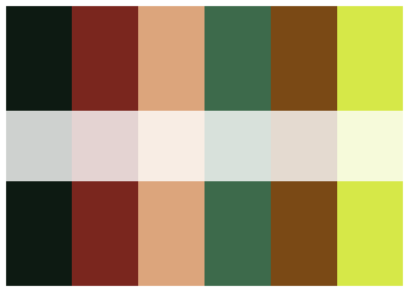
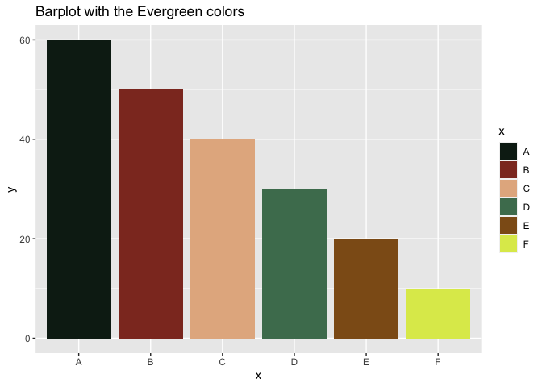

<!-- README.md is generated from README.Rmd. Please edit that file -->

# Evergreen

<!-- badges: start -->
<!-- badges: end -->

`evergreen` is an R package to provide a color palette based on [the
Evergreen ship which got stuck in Suez Canal in March
2021](https://www.washingtonpost.com/world/2021/03/25/faq-suez-canal-ever-given/)




## Installation

You can install the development version of `evergreen` from
[GitHub](https://github.com/) with:

``` r
# install.packages("devtools")
devtools::install_github("ahmedmoustafa/evergreen")
```

## Example

### A barplot with `evergreen`

``` r
library(evergreen)
library(ggplot2)

x = c("A", "B", "C", "D", "E", "F")
y = c(60, 50, 40, 30, 5, 2.5)

ggplot() +
  geom_bar(aes(x = x, y = y, fill = x), stat = "identity") +
  scale_fill_manual(values = evergreen()) +
  ggtitle("Barplot with the Evergreen colors")
```


